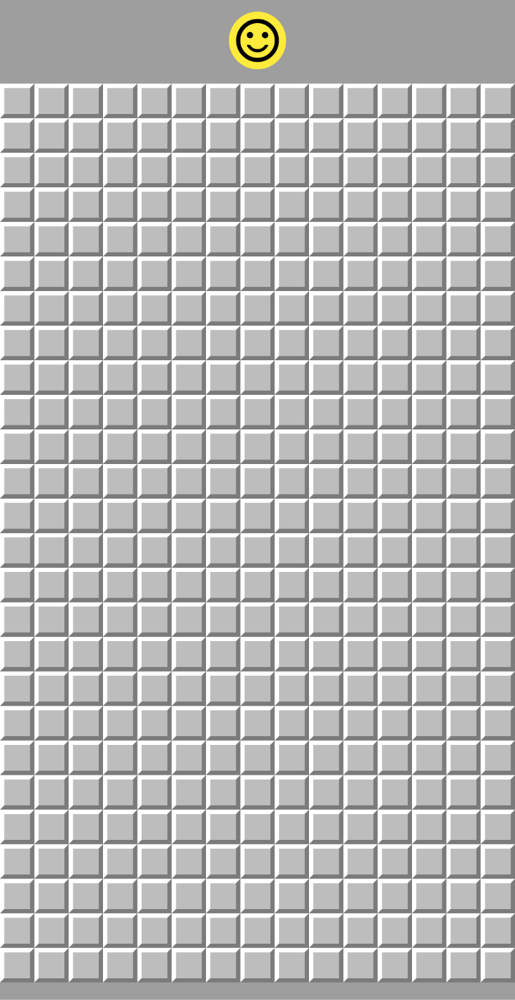
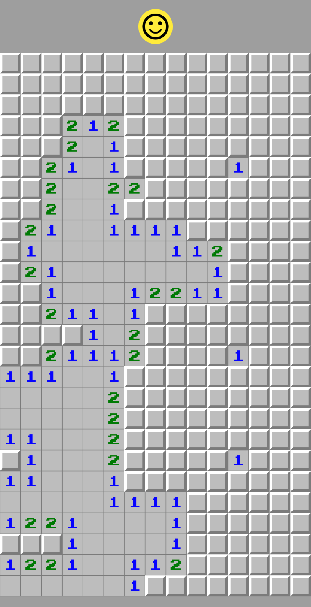
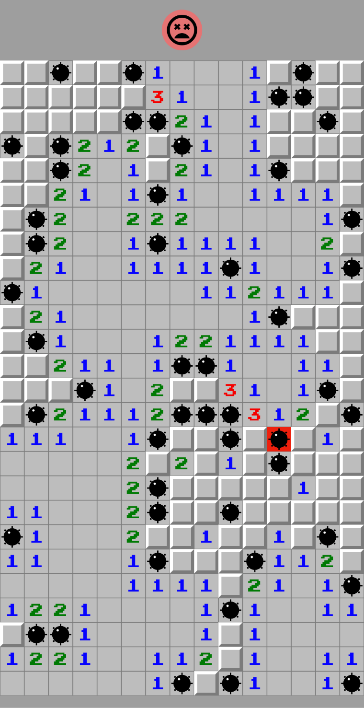

# Campo minado

Projeto de uma campo minado utilizando Flutter

## Sobre

Projeto feito para criar um campo minado utilizando o framework do Flutter.
A camada de controle foi implementada na camada de modelo.

## Screenshots

  
   
  

